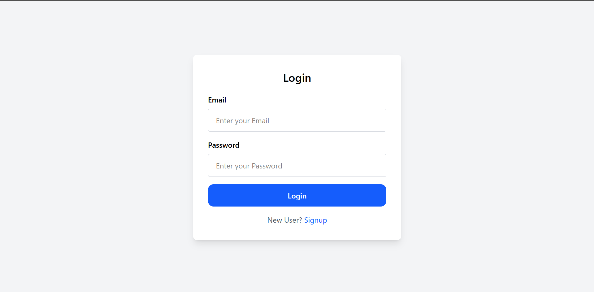
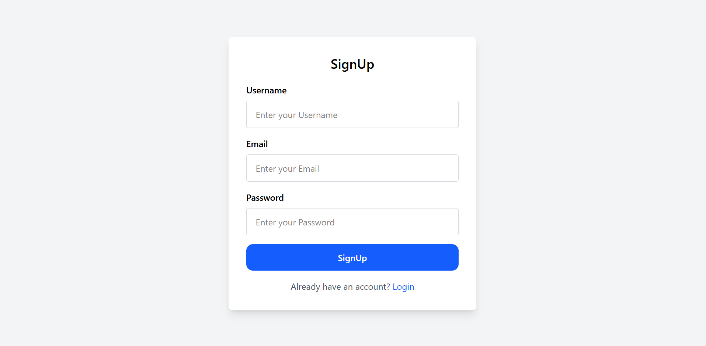
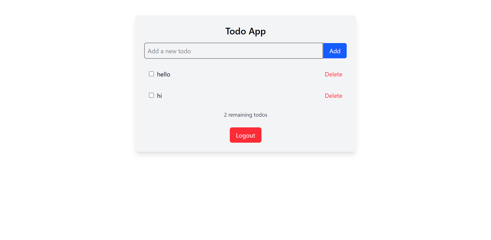

# MERN Todo App with User Authentication

A full-stack Todo application built using the **MERN stack (MongoDB, Express.js, React, Node.js)** with secure **JWT-based authentication**, allowing users to register, log in, and manage their personal todos.

---

## 🔧 Technologies Used

- **Frontend:** React.js, Axios, Tailwind CSS
- **Backend:** Node.js, Express.js, MongoDB, Mongoose
- **Authentication:** JSON Web Tokens (JWT), Cookies
- **Tools:** Postman, VS Code, Git, GitHub

---

## ✨ Features

- ✅ User Signup & Login with JWT Authentication  
- ✅ Add, Update, and Delete Todos  
- ✅ Toggle Todo Completion Status  
- ✅ Secure API access with token validation  
- ✅ Persistent data storage with MongoDB  
- ✅ Responsive UI styled with Tailwind CSS

---

## Login Page 

---
## SignUp

## Home

